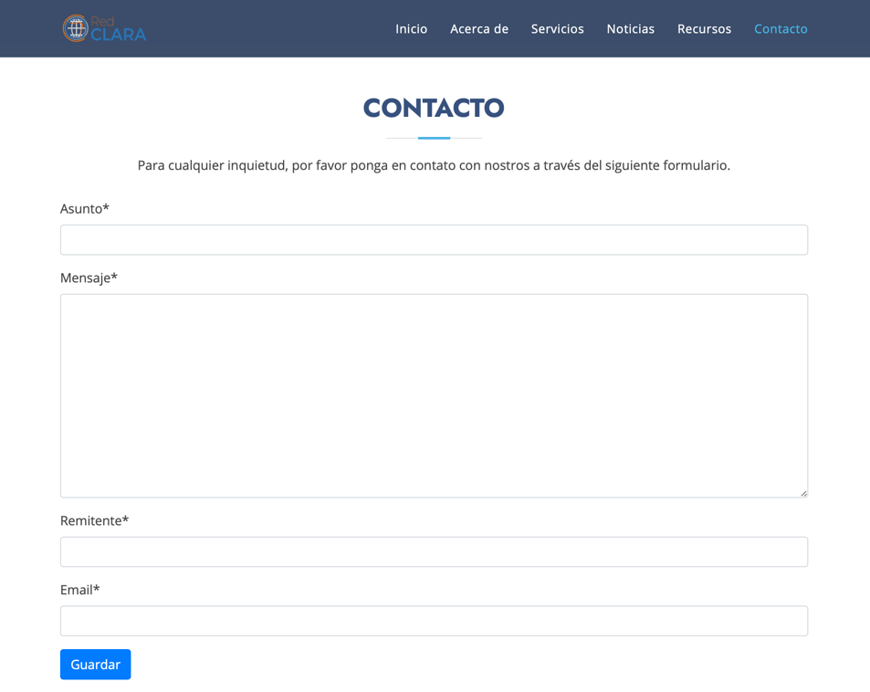
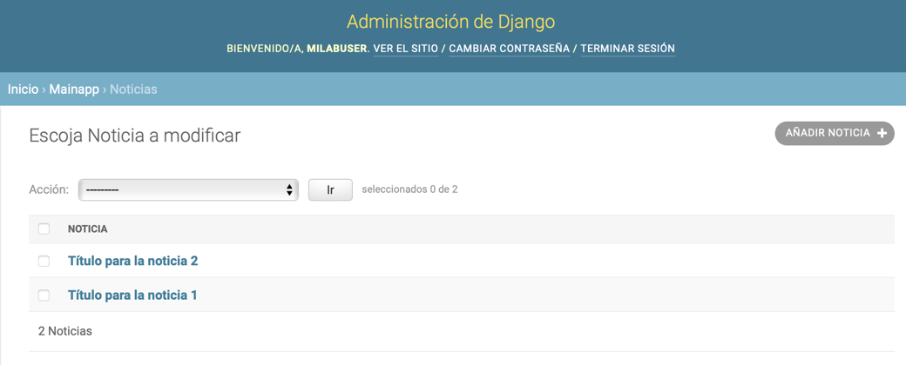

# Tabla de contenido

- [Objetivo de la aplicación](#objetivo-de-la-aplicación)

- [Requisitos de la aplicación](#requisitos-de-la-aplicación)

- [Ingreso a la aplicación](#_Toc58474325)

- [Interfaz de administración](#interfaz-de-administración)

# Objetivo de la aplicación

Esta aplicación tiene como objetivo implementar un mecanismo de control
de acceso para los servicios y recursos vinculados. El control de acceso
se realiza a través de la federación de identidad que provee RedClara.

# Requisitos de la aplicación

-   Dispositivo de cómputo con capacidad de navegación (Computador,
    Tablet o Smartphone).

-   Conexión a Internet.

-   Navegador web (Google Chrome, Mozilla Firefox, Safari, etc.).

# Ingreso a la aplicación

La aplicación está disponible a través Internet en la dirección
<http://milab.redclara.net>. Al momento de ingresar en la aplicación los
usuarios no autenticados serán redirigido al proveedor de identidad
(IDP) utilizado por RedClara (<https://idplaconga.redclara.net>).

Para el proceso de autenticación utilice el usuario y contraseña
indicados por el administrado. Con el inicio de sesión exitoso se
realiza una redirección automática al sitio milab.redclara.net. La
página de inicio se muestra a continuación.

La interfaz comprende una barra de menú ubicada en la parte superior con
las siguientes seis opciones:

-   **Inicio**: Regresar a la parte inicial de la interfaz de la
    aplicación.

-   **Acerca de**: Muestra información descriptiva del proyecto MiLAB.

-   **Servicios**: Despliega información sobre los servicios vinculados
    con la aplicación. La información corresponde al logotipo nombre
    (link) y una breve descripción del servicio.

-   **Noticias**: Contiene información relevante sobre la aplicación
    normalmente hacer de sus servicios y recursos.

-   **Recursos**: Muestra elementos de información relacionados con los
    servicios vinculados. La información de los recursos se muestra como
    texto y documentos adjuntos.

-   **Contacto**: Despliega un formulario para registrar mensajes de
    contacto hacia la aplicación.

# Interfaz de administración

La interfaz de administración del sitio está disponible a través de la
dirección <https://milab.redclara.net/admin>.

Utilice el usuario y contraseña indicado por el administrador. Luego de
la autenticación exitosa, el sitio muestra el siguiente conjunto de
opciones disponibles.

Las opciones del sitio administrativo están divididas en las secciones
“Autenticación y Autorización” y “MainApp”.

En la sección ***Autenticación y Autorización*** están disponibles las
opciones para gestionar (crear, leer, actualizar y eliminar) Grupo y
Usuarios. Ver imágenes siguientes.

Al crear o actualizar un grupo es posible asignar permisos de una lista
disponible como muestra la siguiente imagen.

Al crear o actualizar un grupo es posible asignar permisos de una lista
disponible como muestra la siguiente imagen.

En la sección ***MainApp*** están disponibles las opciones para
gestionar (crear, leer, actualizar y eliminar) Categorías para noticias
y recursos, Contactos, Noticias, Recursos y Servicios. Ver imagen
siguiente.

Gestión de servicios:

Gestión de recursos:

Gestión de Noticias:

Gestionar mensajes de contacto:

